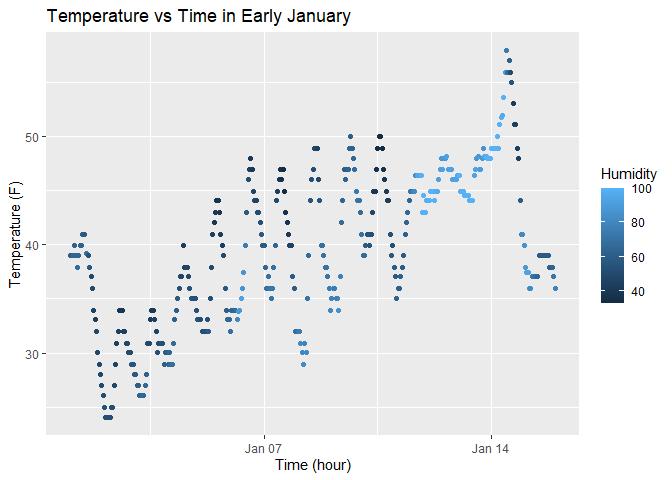

p8105_hw1_mb5357
================
Maria Beg
2025-09-18

## PROBLEM 1

## Loading the dataset

``` r
data("early_january_weather")
```

## Decription of the variables

Used View() to look at the dataset.

There are 15 variables in this dataset.

Variables in the dataset are `origin`, `year`, `month`, `day`, `hour`,
`temp`, `dewp`, `humid`, `wind_dir`, `wind_speed`, `wind_gust`,
`precip`, `pressure`, `visib`, and `time_hour`.

The important variables:

`temp` = The temperature in Fahrenheit

`humid` = The relative humidity

`time_hour` = Date and Hour when each observation was recorded

## Size of the dataset

``` r
num_rows <- nrow(early_january_weather)

num_cols <- ncol(early_january_weather)
```

The number of rows is 358 and the number of columns is 15 in the
dataset.

## The mean temperature

``` r
mean_temp <- mean(pull(early_january_weather, temp))
```

The mean temp is 39.58.

## Scatterplot of `temp` v/s `time_hour`

``` r
ggplot(early_january_weather, 
       aes(x = time_hour, 
           y = temp, 
          color = humid)) +
          geom_point() +
  labs(
    title = "Temperature vs Time in Early January",
    x = "Time (hour)",
    y = "Temperature (F)",
    color = "Humidity"
  )
```

<!-- -->

The scatterplot shows that temperature fluctuates over time, likely
reflecting daily cycles. Humidity values appear to increase around
mid-January, suggesting a shift in weather conditions during that
period.

## Saving the scatterplot

``` r
ggsave("p1805_hw1_mb5357_scatterplot.pdf")
```

    ## Saving 7 x 5 in image

## PROBLEM 2

## Creating a dataframe

``` r
samp <- rnorm(10)

sample_df = tibble(
  sample = samp,
  sample_greater_than_0 = sample > 0,
  chr_vec =  rep(c("red", "blue","yellow", "green", "purple"), length.out = 10),
  fac_vec = factor(rep(c("A", "B", "C"), length.out = 10))
)
```
